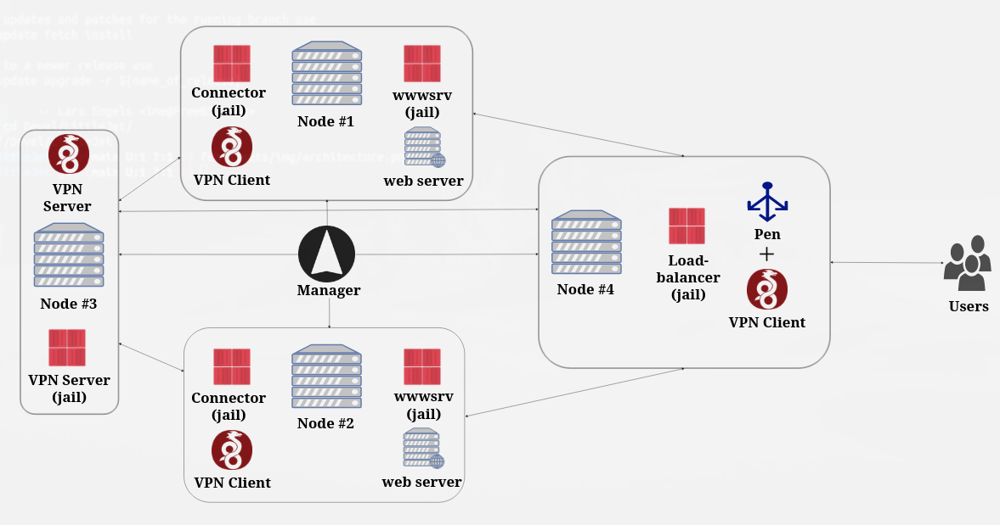

<p align="center">
    
</p>

----

# LittleJet - Create, deploy, manage and scale FreeBSD jails anywhere

LittleJet is an open source, easy-to-use orchestrator for managing, deploying, scaling and interconnecting FreeBSD jails anywhere in the world.

## Quickstart

<p align="center">
    
    <br>
    Just a few commands and you will get deployed the project on all nodes.
</p>

```sh
git clone https://github.com/DtxdF/hello-http
cd ./hello-http/
jet create hello
jet add-node <node #1>
jet add-node <node #2> # optional
jet add-node <node #3> # optional
jet run-script -p hello deploy.all
jet show hello
jet run-appjail -Pp hello cmd jexec hello-http fetch -qo - http://localhost
jet destroy hello
```

## How LittleJet works: architecture

<p align="center">
    
    <br>
    Sample architecture: Load balancing two web server replicas on nodes #1 and #2.
</p>

Although it may be much more basic than the image above, showing all the toys is better to demonstrate what you can do with LittleJet.

In the image above there are four nodes. The first and second nodes have a replica of the same web server, so they provide the same service. The fourth node provides the load balancing software. The question is: how does the load balancer on the fourth node send and receive packets to and from the first and second nodes? Easy: They are all connected to the same VPN server on the third node, but the difference is how they connect to that node. The first and second nodes use a jail called *connector* that has the VPN client and some packet filter rules configured to forward packets to the web server, so nodes on the same VPN can make HTTP requests. The load balancer itself has two pieces of software, the load balancer and the VPN client, and you only need to have all the connector's IP addresses to load balance them all.

All of these pieces are created, configured and deployed using LittleJet with just a few commands from Manager, the host that can connect to all nodes in the cluster.

## What you can do with LittleJet: features

### Projects instead of jails

Instead of simply dealing with jails, we exploit the concept of [Director](https://github.com/DtxdF/director) projects. A project is simply a group of jails and this is very useful because you can deploy one or more jails on the same node to take advantage of locality. Also, since there are many projects already created, you can simply copy them, edit them to suit your environment, and simply deploy them.

### RunScripts

We can just strictly implement all the things in LittleJet, such as the connector, load balancer, deployment algorithms, etc. There is another way to implement those things: through RunScripts.

A RunScript is a form of automation that LittleJet uses to perform more tasks than it was initially designed for. In this way, LittleJet is very modular and can be integrated with any other system. Even better: you don't need to write a RunScript in the POSIX shell, you can use the language of your choice, for example, Python, Golang, Rust, etc.

Some RunScripts already implemented:

<p align="center">
    
    <br>
    deploy.random: Deploy a project to a randomly chosen node.
</p>

<p align="center">
    
    <br>
    deploy.once: Deploy a project to a node if it is not already deployed to any of them.
</p>

<p align="center">
    
    <br>
    deploy.each: For each run, deploy to any of the nodes.
</p>

<p align="center">
    
    <br>
    deploy.single: Deploy a project to the given node.
</p>

### Scaling

An orchestrator that cannot automatically scale to other nodes is not that useful. LittleJet scales your project easily and effortlessly with —surprise— a RunScript.

<p align="center">
    
    <br>
    Deploying a project with a minimum of two replicas.
</p>

Very simple, but in real life the web server will be overloaded, can LittleJet auto-scale the project using jail or project metrics?

<p align="center">
    
    <br>
    Yes!
</p>

### Load balancing / Failover / Multi-host networking

You say that you have a replica of a web server on many nodes around the world, in several countries, but you want to access it using your favorite web browser on your laptop.

<p align="center">
    
    <br>
    Load balancing three replicas of a web server.
</p>

<p align="center">
    
    <br>
    Failover.
</p>

### And much more...

LittleJet is very, very simple: it depends on the lower layers to do its job, i.e. it depends on [AppJail](https://github.com/DtxdF/AppJail), [Director](https://github.com/DtxdF/director), etc., so check out those projects to see what crazy combinations you can make.

## Dependencies

### Manager

* [textproc/jq](https://freshports.org/textproc/jq)
* [sysutils/cpdup](https://freshports.org/sysutils/cpdup)
* [textproc/sansi](https://freshports.org/textproc/sansi)

### Nodes

* [sysutils/cpdup](https://freshports.org/sysutils/cpdup)
* [sysutils/py-director](https://freshports.org/sysutils/py-director)
* [sysutils/appjail](https://freshports.org/sysutils/appjail) or [sysutils/appjail-devel](https://freshports.org/sysutils/appjail-devel)

## Documentation

* [wiki](https://github.com/DtxdF/LittleJet/wiki)
* `man 1 littlejet`
* `man 5 littlejet.conf`

## Recommendations

Configuring each node can be painful if there are a lot of nodes, so use a tool like Ansible or Puppet to suit your environment.

## Contributing

Here is a list of some things you can contribute to LittleJet:

* Report or fix bugs.
* Create a new RunScript. You don't need to submit a PR to this repository, you can create your own repository and share it, so I can create a new section on the wiki called *"User RunScripts"*. Of course, if you want to send me a PR with your RunScript, I have no problem.
* Contribute to projects this project depends on, such as [AppJail](https://github.com/DtxdF/AppJail) or [Director](https://github.com/DtxdF/director).
* ...

## Notes

1. `BatchMode` is set to `yes`, which means, quoting an excerpt from `ssh_config(5)`, *“... user interaction, such as password prompt and host key confirmation prompts, will be disabled.“*

    If you have your SSH private key with a password, use `ssh-add(1)` and `ssh-agent(1)` before using LittleJet.
2. The `-t` parameter of `ssh(1)` is set, which means that if you want to process some text, you cannot do so because the text will be mangled. This note is when using one of the `run-*` subcommands. A simple workaround is the `-C` flag in one of the `run-*` subcommands that use sansi to remove such control characters.
4. If you installed Director using pipx, note that it cannot be used over SSH when installed in `~/.local/bin/appjail-director` because `~/.local/bin` is not yet in the PATH environment variable that is loaded by `~/.profile`:

    ```sh
    $ ssh <node> which appjail-director
    $ echo $?
    1
    $ ssh <node> ls .local/bin/appjail-director
    .local/bin/appjail-director
    $ echo $?
    0
    ```

    A simple workaround is to add the following script in your `/usr/local/bin`.

    Note that this is not necessary when installed using [sysutils/py-director](https://freshports.org/sysutils/py-director).
5. LittleJet is designed to run as a non-root user, but on the remote site, AppJail needs privileges. If you are not using root on the remote site, [configure AppJail to use a trusted user](https://appjail.readthedocs.io/en/latest/trusted-users/).
6. Do not put your volumes in the same directory as the project because they can be overwritten when redeploying or simply destroyed when destroying a project. Use an external directory on each node.
7. The remote user must use the `sh(1)` shell.
8. Allowed characters:
    
    - Labels: `^[a-z][a-z0-9]*((\.|-)?[a-z][a-z0-9]*)*$`
    - Nodes: `^[a-zA-Z0-9._@-]+'`
    - Projects: `^[a-zA-Z0-9._-]+$`
9. Keep in-sync AppJail, Director and LittleJet.
